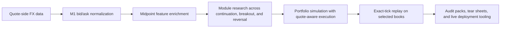

# RazerBack

RazerBack is a research-first FX backtesting and execution framework built around one core idea: if the execution model is not believable, the backtest is not useful.

The public repo is designed to show the engineering, validation discipline, and research workflow behind the system without turning the front page into a full strategy dump. It shares the data pipeline, feature enrichment, realistic execution engine, exact-tick replay tooling, production wiring, and robustness audit workflow. It does not narrate every live research decision or private portfolio-curation rule.

## What RazerBack Is

RazerBack is built to:

- ingest quote-side FX data
- enrich it with research features
- search and validate systematic modules across multiple strategy families
- simulate portfolios with quote-aware execution assumptions
- replay selected books against raw tick quotes
- package outputs in a form a serious allocator or desk can actually audit

It is not a toy notebook stack, and it is not a claim that a public GitHub repo can replicate the full market-data and execution footprint of a large multi-manager platform.

## Why It Exists

Most public FX backtests break down in one of four ways:

- they trade midpoint bars and ignore the quote side
- they treat spread and execution as an afterthought
- they optimize on one window and market the best chart
- they produce outputs that cannot be traced, replayed, or challenged

RazerBack exists to push the opposite direction:

- bid/ask first
- explicit execution assumptions
- exact-tick verification where it matters
- artifact-driven research instead of screenshot-driven research

## Public Snapshot

As of `2026-04-23`, the clean public research checkpoint shows:

| checkpoint | roi_pct | sharpe_ann | max_drawdown_pct | win_rate_pct | profit_factor | trades |
| --- | ---: | ---: | ---: | ---: | ---: | ---: |
| public launch candidate, 2025 M1 | 20.7957 | 1.9903 | -3.7649 | 70.5882 | 2.9950 | 34 |
| same book, 2025 exact tick replay | 22.0243 | 2.1027 | -3.6925 | 70.5882 | 3.1766 | 34 |

That is encouraging, but it is not presented here as a finished pod-grade claim. The current public checkpoint still has known limitations:

- continuous validated yearly coverage is incomplete for `2014-2019`
- the full Dukascopy harvest is still in progress
- full-horizon exact-tick replay has not yet been completed for every audited year
- the current launch candidate is a `2026` launch-oriented research book, not a pristine untouched historical walk-forward reveal

The current public robustness summary lives in [research/robustness_2026-04-23/README.md](research/robustness_2026-04-23/README.md).

## System Overview



## Design Principles

- `Quote-aware by default`
  Long entries execute on ask, shorts on bid, and the engine keeps the correct side of the quote through the run.
- `Research and runtime separation`
  Discovery scripts can be noisy; the locked runtime and artifact writers are kept much tighter.
- `Validation before storytelling`
  The repo prefers reproducible CSVs, reports, and replay paths over headline claims.
- `Public credibility over fake certainty`
  Where the data or coverage is incomplete, the docs say so directly.
- `Performance matters, but realism matters more`
  Rust acceleration and automation are included because faster honest research beats slower fragile research.

## What Is In The Repo

- [run_locked_portfolio.py](run_locked_portfolio.py)
  Primary runtime entrypoint for the locked/public reference portfolio.
- [continuation_core.py](continuation_core.py)
  Core signal, exit, and portfolio-accounting logic.
- [locked_portfolio_runtime.py](locked_portfolio_runtime.py)
  Config loading, artifact generation, and export helpers.
- [realistic_backtest.py](realistic_backtest.py)
  Bid/ask loading and shared execution-data plumbing.
- [enrich_forex_research_data.py](enrich_forex_research_data.py)
  Feature-enrichment pipeline.
- [fxbacktest/strategies/v_sentinel.py](fxbacktest/strategies/v_sentinel.py)
  Public strategy implementation scaffold for the V-Sentinel family.
- [scripts/](scripts/)
  Research, audit, download, reporting, packaging, and automation scripts.
- [rust/fxbacktest_core](rust/fxbacktest_core)
  Optional Rust acceleration layer via `pyo3` and `maturin`.
- [tests/](tests/)
  Parity and strategy tests for the public engine.
- [research/robustness_2026-04-23](research/robustness_2026-04-23)
  Public-facing checkpoint of the current honesty-first research state.

## Data And Execution Model

RazerBack supports two main data paths:

- `OANDA bid/ask M1`
  Useful for clean runtime validation and live-system consistency.
- `Dukascopy raw quote ticks`
  Used for deeper research, exact-tick replay, and realism checks.

Execution realism in the public engine includes:

- quote-side entry and exit handling
- spread-aware fills
- entry delay support
- slippage scenarios
- portfolio concurrency and leverage limits
- annual and monthly risk overlays

What it does not claim today:

- full venue depth
- queue-position modeling
- prime-broker internalization behavior
- the complete data footprint of a large institutional FX platform

## Validation Philosophy

The repo is built around a layered validation ladder:

1. `Module-level research`
   Search across continuation, breakout, and reversal modules on completed data.
2. `Portfolio simulation`
   Combine modules under capital, leverage, and concurrency rules.
3. `Recent-window robustness`
   Weight modern behavior more heavily without pretending old regimes do not matter.
4. `Exact-tick replay`
   Re-check selected books against raw bid/ask quote ticks.
5. `Pod-style audit`
   Force a pass/fail view on continuity, coverage, realism, and reproducibility.

The public audit helpers are:

- [scripts/run_exact_tick_replay.py](scripts/run_exact_tick_replay.py)
- [scripts/run_pod_grade_audit.py](scripts/run_pod_grade_audit.py)

## Quick Start

### Install

```bash
python -m pip install -r requirements.txt
```

Optional Rust build:

```bash
cd rust/fxbacktest_core
maturin develop --release
```

### Enrich M1 data

```bash
python enrich_forex_research_data.py --data-dir data
```

### Run the public reference portfolio

```bash
python run_locked_portfolio.py \
  --config configs/continuation_portfolio_total_v1.json \
  --data-dir data
```

### Benchmark Python vs Rust

```bash
python scripts/benchmark_core.py \
  --config configs/continuation_portfolio_total_v1.json \
  --data-dir C:/fx_data/m1
```

### Run public research utilities

```bash
python scripts/run_multifamily_fx_research.py --help
python scripts/run_exact_tick_replay.py --help
python scripts/run_pod_grade_audit.py --help
```

## Research Workflows

The public repo includes the main workflow pieces used in active research:

- [scripts/run_multifamily_fx_research.py](scripts/run_multifamily_fx_research.py)
  Broad breakout/reversal search on the current enriched surface.
- [scripts/run_universe_continuation_research.py](scripts/run_universe_continuation_research.py)
  Continuation-module search over the current universe snapshot.
- [scripts/run_portfolio_factory_research.py](scripts/run_portfolio_factory_research.py)
  Mixed-family portfolio construction and pruning.
- [scripts/run_recent_weighted_portfolio_audit.py](scripts/run_recent_weighted_portfolio_audit.py)
  Modern-regime weighting and recent-window audit logic.
- [scripts/run_breakout_ladder_exit_research.py](scripts/run_breakout_ladder_exit_research.py)
  Exit-structure research for breakout variants.
- [scripts/generate_edge_audit.py](scripts/generate_edge_audit.py)
  Artifact-focused research summary generation.

## Live And Production Tooling

The repo also includes a production-facing layer for demo/live operational testing:

- [scripts/live_trading_engine.py](scripts/live_trading_engine.py)
  OANDA live engine scaffold with trade logging and single-instance guardrails.
- [live_reporting.py](live_reporting.py)
  SQLite ledger export and reporting helpers.
- [scripts/generate_daily_tear_sheet.py](scripts/generate_daily_tear_sheet.py)
  Daily PDF reporting.
- [scripts/generate_investor_report.py](scripts/generate_investor_report.py)
  Weekly/monthly investor report generation.
- [scripts/register_production_tasks.ps1](scripts/register_production_tasks.ps1)
  Windows scheduled-task bootstrap.
- [scripts/package_production_bundle.py](scripts/package_production_bundle.py)
  Assembles a self-contained production bundle.

This layer is included because serious research should be able to connect to serious operations, not because the public repo is advertising a turnkey black-box live fund.

## What The Public Repo Intentionally Does Not Spell Out

The front page is deliberately explicit about process and deliberately selective about recipe detail.

It does not walk through:

- the exact current private launch-book curation logic
- every rejected or active research branch
- private operational thresholds
- credentials, deployment secrets, or internal environment details

In other words, this repo is meant to show that the work is real, disciplined, and technically credible, without pretending the front page should be the alpha memo.

## Current Limitations

- The current strongest public checkpoint is still a partial-horizon honesty pack, not a full continuous `2011-2025` proof.
- The raw data harvest is still being completed for part of the long sample.
- Exact-tick replay is available and working, but full-horizon replay coverage is not done yet for every public claim.
- A strong public FX research stack is still not the same thing as a full institutional multi-venue execution stack.

## Repo Hygiene

- `data/` is local and ignored by git.
- `output/` is generated and ignored by git.
- Rust build output is ignored.
- Public docs focus on methodology, realism, and validation rather than publishing every active recipe in plain sight.

## Additional Reading

- [ARCHITECTURE.md](ARCHITECTURE.md)
- [reference_artifacts/README.md](reference_artifacts/README.md)
- [BENCHMARK.md](BENCHMARK.md)
- [research/robustness_2026-04-23/README.md](research/robustness_2026-04-23/README.md)
